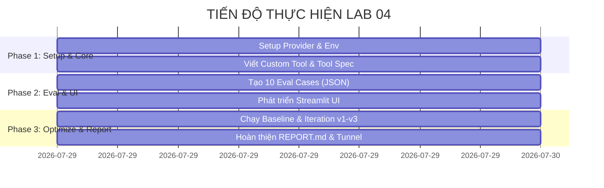

# BẢNG PHÂN CHIA NHIỆM VỤ NHÓM (LAB 04 - RESEARCH AGENT TOOL EVAL)

> **Dự án:** Research Agent Tool Evaluation  
> **Số lượng thành viên:** 03 người  
> **Thời gian thực hiện:** Lab 04  

---

## I. TỔNG QUAN PHÂN CHIA VAI TRÒ

| STT | Thành viên (Họ & Tên / MSSV) | Vai trò chính | Trọng tâm công việc |
|:---:|:---|:---|:---|
| **1** | **Thành viên 1** *(Nguyễn Minh Hùng - Leader)* | **Agent Core & Tool Developer** | Core Agent, YeScale Provider, Viết Custom Tools, Tối ưu Prompt & Versioning (`v1`, `v2`, `v3`) |
| **2** | **Thành viên 2** *(Thành viên 02)* | **Eval & Report Specialist** | Xây dựng Dataset (`eval_group.json`), Chạy Benchmark, Phân tích Log JSON, Viết Báo cáo `REPORT.md` |
| **3** | **Thành viên 3** *(Thành viên 03)* | **UI/UX & Deployment Engineer** | Xây dựng Giao diện Streamlit (`app.py`), Hiển thị Trace/Log tool, Tunnel Deployment (Cloudflare Tunnel) |

---

## II. CHI TIẾT NHIỆM VỤ VÀ DELIVERABLES

### 1. Thành viên 1: Agent Core & Tool Developer (Leader)
* **Mục tiêu:** Đảm bảo Core Agent chạy ổn định với YeScale Provider, gọi đúng tool, truyền đúng argument và có cơ chế quản lý phiên bản (versioning).

| Mã NV | Hạng mục công việc | Mô tả chi tiết | Các file liên quan | Deliverable / Trạng thái |
|:---:|:---|:---|:---|:---|
| **TV1-01** | **Setup YeScale Provider** | Tích hợp OpenAI-compatible API cho YeScale Provider, cấu hình `.env` & `.env.example`, đăng ký provider factory. | [yescale_provider.py](file:///d:/AI_Thuc_Chien/Lab04/starter_v0/providers/yescale_provider.py) [__init__.py](file:///d:/AI_Thuc_Chien/Lab04/starter_v0/providers/__init__.py) [.env.example](file:///d:/AI_Thuc_Chien/Lab04/starter_v0/.env.example) | ✅ Provider kết nối thành công YeScale |
| **TV1-02** | **Phát triển Custom Tool** | Viết ít nhất 01 tool mới cho Agent, viết `TOOL.md` hướng dẫn, khai báo trong `tools/__init__.py` và `artifacts/tools.yaml`. | [tools/](file:///d:/AI_Thuc_Chien/Lab04/starter_v0/tools) [artifacts/tools.yaml](file:///d:/AI_Thuc_Chien/Lab04/starter_v0/artifacts/tools.yaml) | 📦 Custom Tool chạy tốt & pass unit tests |
| **TV1-03** | **Tối ưu Prompt & Versioning** | Tối ưu `system_prompt.md` qua ít nhất 3 phiên bản (`v1`, `v2`, `v3`) để giảm lỗi gọi tool, ghi log thay đổi vào `version_log.csv`. | [system_prompt.md](file:///d:/AI_Thuc_Chien/Lab04/starter_v0/artifacts/system_prompt.md) [version_log.csv](file:///d:/AI_Thuc_Chien/Lab04/starter_v0/artifacts/version_log.csv) | 📝 Đủ 3 phiên bản prompt có so sánh cải thiện |
| **TV1-04** | **Phối hợp Core Loop** | Đảm bảo `agent.py`, `chat.py`, `versioning.py` trả về đúng format dữ liệu `rounds`, `tool_events` cho UI và Eval runner. | [agent.py](file:///d:/AI_Thuc_Chien/Lab04/starter_v0/agent.py) [chat.py](file:///d:/AI_Thuc_Chien/Lab04/starter_v0/chat.py) | ⚡ Core Loop chạy mượt không crash |

---

### 2. Thành viên 2: Eval & Report Specialist
* **Mục tiêu:** Xây dựng bộ testcase đánh giá, thực thi kiểm thử agent qua các phiên bản, phân tích dữ liệu log và tổng hợp báo cáo chi tiết.

| Mã NV | Hạng mục công việc | Mô tả chi tiết | Các file liên quan | Deliverable / Trạng thái |
|:---:|:---|:---|:---|:---|
| **TV2-01** | **Xây dựng Eval Dataset** | Xây dựng 10 testcase tiêu chuẩn trong `data/eval_group.json` (bao gồm 5 single-turn và 5 multi-turn). | [data/eval_group.json](file:///d:/AI_Thuc_Chien/Lab04/starter_v0/data/eval_group.json) | 📊 Đủ 10 eval cases đúng cấu trúc |
| **TV2-02** | **Thực thi Eval Benchmark** | Chạy `run_eval.py` cho Baseline và các phiên bản `v1`, `v2`, `v3`. Lưu trữ đầy đủ JSON logs và transcripts. | [run_eval.py](file:///d:/AI_Thuc_Chien/Lab04/starter_v0/run_eval.py) [runs/](file:///d:/AI_Thuc_Chien/Lab04/starter_v0/runs) [transcripts/](file:///d:/AI_Thuc_Chien/Lab04/starter_v0/transcripts) | 📁 Đầy đủ log JSON cho từng run |
| **TV2-03** | **Phân tích Log & Metrics** | Đánh giá tỷ lệ thành công (Success rate), lỗi gọi tool (Tool call error), tham số sai (Arg error), vòng lặp (Loop stall). | [analysis/](file:///d:/AI_Thuc_Chien/Lab04/starter_v0/analysis) | 📈 Bảng số liệu phân tích lỗi qua các version |
| **TV2-04** | **Soạn thảo REPORT.md** | Hoàn thiện Báo cáo Lab 04: Phần A (hoàn thành trước demo) và Phần B (tổng kết chi tiết kết quả thử nghiệm). | [artifacts/REPORT.md](file:///d:/AI_Thuc_Chien/Lab04/starter_v0/artifacts/REPORT.md) | 📄 File REPORT.md hoàn chỉnh |

---

### 3. Thành viên 3: UI/UX & Deployment Engineer
* **Mục tiêu:** Xây dựng giao diện xem và tương tác Agent trực quan, hiển thị rõ ràng Tool Execution Trace và triển khai URL public cho nhóm khác test.

| Mã NV | Hạng mục công việc | Mô tả chi tiết | Các file liên quan | Deliverable / Trạng thái |
|:---:|:---|:---|:---|:---|
| **TV3-01** | **Phát triển UI Streamlit** | Tạo file `app.py` với giao diện Chat trực quan, cho phép chọn phiên bản Model/Prompt/Tool set. | [app.py](file:///d:/AI_Thuc_Chien/Lab04/starter_v0/app.py) | 💻 Web UI chạy tại `http://localhost:8501` |
| **TV3-02** | **Hiển thị Tool Trace & Log** | Tích hợp hiển thị chi tiết các Tool Event (Tên tool, arguments, status, kết quả/lỗi) dưới dạng expander/card trực quan. | [app.py](file:///d:/AI_Thuc_Chien/Lab04/starter_v0/app.py) | 🔍 Trace tool rõ ràng trên giao diện |
| **TV3-03** | **Quản lý Transcript & State** | Lưu trữ transcript cuộc trò chuyện trên UI, hiển thị lịch sử các lần chạy và phiên bản artifact tương ứng. | [app.py](file:///d:/AI_Thuc_Chien/Lab04/starter_v0/app.py) | 💾 Session state & transcript history |
| **TV3-04** | **Deploy Public Link (Tunnel)** | Thiết lập Cloudflare Tunnel (`cloudflared`) để public cổng app cho người dùng/nhóm khác truy cập trực tiếp. | `cloudflared tunnel` | 🌐 URL public hoạt động ổn định |

---

## III. MA TRẬN PHÂN CÔNG TRÁCH NHIỆM (RACI MATRIX)

* **R (Responsible):** Người trực tiếp thực hiện công việc.
* **A (Accountable):** Người chịu trách nhiệm chính về kết quả cuối cùng.
* **C (Consulted):** Người đóng góp ý kiến, tham vấn.
* **I (Informed):** Người nhận thông tin cập nhật.

| Hạng mục / Công việc | TV1 (Leader) | TV2 (Eval) | TV3 (UI/Deploy) |
|:---|:---:|:---:|:---:|
| Tích hợp YeScale Provider & Core Agent | **R / A** | I | C |
| Viết Custom Tool & Khai báo Tools | **R / A** | C | I |
| Xây dựng Dataset 10 Eval Cases | C | **R / A** | I |
| Chạy Benchmark & Thu thập JSON Logs | C | **R / A** | I |
| Tối ưu Prompt v1, v2, v3 & Version Log | **R / A** | C | I |
| Xây dựng UI Streamlit (`app.py`) | C | I | **R / A** |
| Triển khai Public Tunnel (`cloudflared`) | I | I | **R / A** |
| Viết Báo cáo `REPORT.md` (Phần A & B) | C | **R / A** | C |

---

## IV. TIẾN ĐỘ THỰC HIỆN THEO PHASE

### Tiêu chí nghiệm thu chung (Definition of Done - DoD):
1. **Core:** Chạy ổn định Provider YeScale, không văng exception unhandled.
2. **Tools:** Đủ 5+ tools cơ bản + 1 custom tool có `TOOL.md` chỉn chu.
3. **Dataset:** Đủ 10 eval cases (5 single + 5 multi-turn) trong `eval_group.json`.
4. **Optimization:** Đủ 3 phiên bản tối ưu `v1`, `v2`, `v3` có `version_log.csv` ghi nhận rõ ràng.
5. **UI:** Streamlit khởi chạy thành công, hiển thị được agent trace và có link tunnel public.
6. **Report:** Báo cáo `REPORT.md` đầy đủ nội dung Phần A & Phần B.

---

> **Lưu ý:** Các thành viên có thể thay đổi Họ tên và MSSV tại phần **I. TỔNG QUAN PHÂN CHIA VAI TRÒ** cho phù hợp với danh sách nhóm thực tế.
