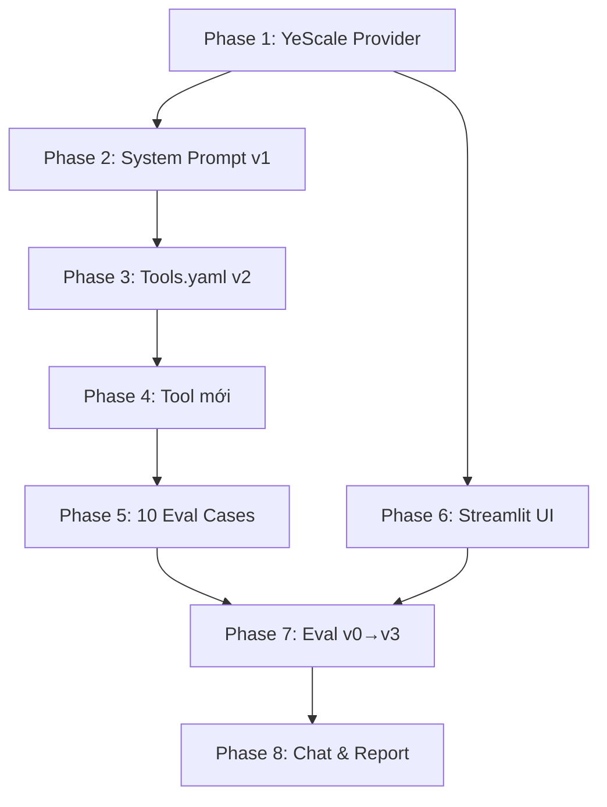

# Kế hoạch thực thi — Lab04 Research Agent (YeScale Provider)

Mô tả: Sửa code để dùng **YeScale** (`https://api.yescale.io/v1`) làm model provider, sau đó hoàn thiện toàn bộ repo theo yêu cầu lab.

---

## Phase 1 — Tạo YeScale Provider & Cấu hình môi trường

### 1.1. Tạo YeScale provider

#### [NEW] [yescale_provider.py](file:///d:/AI_Thuc_Chien/Lab04/starter_v0/providers/yescale_provider.py)

Tương tự `openrouter_provider.py`, kế thừa `OpenAIProvider` (vì YeScale dùng OpenAI-compatible API):

```python
class YeScaleProvider(OpenAIProvider):
    def __init__(self) -> None:
        super().__init__(
            api_key_env="YESCALE_API_KEY",
            base_url="https://api.yescale.io/v1",
            default_model="gpt-4o-mini",  # hoặc model mà YeScale hỗ trợ
        )
```

### 1.2. Sửa `.env.example` và `.env`

#### [MODIFY] [.env.example](file:///d:/AI_Thuc_Chien/Lab04/starter_v0/.env.example)

Thêm:
```
YESCALE_API_KEY=
```

#### [NEW/MODIFY] `.env`
Điền key thật:
```
YESCALE_API_KEY=<your-actual-key>
```

### 1.3. Đăng ký provider trong factory

#### [MODIFY] [__init__.py](file:///d:/AI_Thuc_Chien/Lab04/starter_v0/providers/__init__.py)

Thêm import `YeScaleProvider` và case `"yescale"` vào `make_provider()`.

### 1.4. Cập nhật CLI choices

#### [MODIFY] [chat.py](file:///d:/AI_Thuc_Chien/Lab04/starter_v0/chat.py)
#### [MODIFY] [run_eval.py](file:///d:/AI_Thuc_Chien/Lab04/starter_v0/run_eval.py)
#### [MODIFY] [preflight_provider.py](file:///d:/AI_Thuc_Chien/Lab04/starter_v0/scripts/preflight_provider.py)

Thêm `"yescale"` vào `choices=["openrouter", "openai", "anthropic", "gemini", "yescale"]` trong tất cả argparse.

### 1.5. Verify

```bash
python scripts/preflight_provider.py --provider yescale
```

---

## Phase 2 — Cải thiện System Prompt (v1)

#### [MODIFY] [system_prompt.md](file:///d:/AI_Thuc_Chien/Lab04/starter_v0/artifacts/system_prompt.md)

System prompt hiện tại **cố tình sai** (bảo agent đoán bừa, không hỏi lại, tự gửi không xác nhận) → Sẽ fail hầu hết eval cases.

Sửa thành prompt phù hợp:
- Khi thiếu thông tin quan trọng (handle, URL) → dùng `clarify` hỏi lại
- Trước hành động ghi/gửi (send) → dùng `clarify` xác nhận yes_no
- Câu ngoài phạm vi research → trả lời thẳng, KHÔNG gọi tool
- Câu meta ("bạn là gì") → trả lời thẳng
- Map tên người nổi tiếng → Twitter handle (Sam Altman→sama, Elon Musk→elonmusk, v.v.)
- "hôm nay" → timeframe=day, "tuần này" → timeframe=week
- "phổ biến/top" → search_type=Top

---

## Phase 3 — Cải thiện Tool Declarations (v2)

#### [MODIFY] [tools.yaml](file:///d:/AI_Thuc_Chien/Lab04/starter_v0/artifacts/tools.yaml)

Tool descriptions hiện tại quá **mơ hồ** (tiếng Việt ngắn, không phân biệt rõ) → Sửa:
- `clarify`: Nêu rõ dùng khi thiếu info hoặc xác nhận hành động nhạy cảm
- `timeline`: Nêu rõ "lấy tweet CỦA một user cụ thể", dùng `screenname` = Twitter handle
- `social_search`: Nêu rõ "tìm tweet THEO CHỦ ĐỀ/từ khóa"
- `lookup`: Nêu rõ web search với topic và timeframe
- `fetch`: Nêu rõ "đọc nội dung một URL cụ thể đã biết"
- `format`: Nêu rõ khi nào gọi (sau khi đã có items)
- `send`: Nêu rõ PHẢI xác nhận trước (confirmed=true mới gửi)

---

## Phase 4 — Tạo Tool mới (bắt buộc ít nhất 1)

> [!IMPORTANT]
> Cần ít nhất 1 tool mới do nhóm tự viết. Gợi ý các tool hữu ích:

**Gợi ý tool:**

| Tool | Chức năng | API |
|---|---|---|
| `weather` | Tra thời tiết | OpenWeatherMap hoặc wttr.in (miễn phí) |
| `translate` | Dịch thuật | Google Translate API hoặc DeepL |
| `summarize` | Tóm tắt văn bản dài | Dùng chính YeScale LLM |
| `calculator` | Tính toán biểu thức | Python eval (an toàn) |
| `currency` | Chuyển đổi tỷ giá | ExchangeRate API |
| `stock` | Tra giá cổ phiếu | Yahoo Finance API |

Cho mỗi tool mới, cần tạo:

#### [NEW] `tools/<tool_name>/TOOL.md`
#### [NEW] `tools/<tool_name>/tool.py`
#### [MODIFY] `tools/__init__.py` — thêm import và key vào `TOOL_FUNCTIONS`
#### [MODIFY] `artifacts/tools.yaml` — thêm declaration

---

## Phase 5 — Viết 10 Team Eval Cases

#### [MODIFY] [eval_group.json](file:///d:/AI_Thuc_Chien/Lab04/starter_v0/data/eval_group.json)

Viết đúng 10 case:

**5 Single-turn:**
1. Routing đúng tool mới
2. Wrong arg value test
3. Out of scope test
4. Unnecessary tool test
5. Wrong boundary test (xác nhận trước hành động)

**5 Multi-turn:**
6. Clarify rồi cung cấp thông tin
7. Sửa lại thông tin từ turn trước
8. Carry-over context qua turns
9. Switch tool giữa các turns
10. Cancel request giữa chừng (no_tool)

---

## Phase 6 — Build Streamlit UI

#### [NEW] [app.py](file:///d:/AI_Thuc_Chien/Lab04/starter_v0/app.py)

Streamlit app bao gồm:
- Chat interface (input/output)
- Sidebar: chọn version, hiển thị artifact info
- Tool trace panel: tên tool, args, result/error cho mỗi round
- Transcript auto-save
- Tái sử dụng `run_model_tool_loop` từ `chat.py`

#### [MODIFY] [requirements.txt](file:///d:/AI_Thuc_Chien/Lab04/starter_v0/requirements.txt)
Thêm `streamlit>=1.30.0`

Verify:
```bash
streamlit run app.py
```

---

## Phase 7 — Chạy Eval & Ghi Version Log

### 7.1. Chạy v0 (baseline)
```bash
python run_eval.py --provider yescale --version v0 --suite base --eval-cases data/eval_base.json
```

### 7.2. Sửa system prompt → Chạy v1
```bash
python run_eval.py --provider yescale --version v1 --suite base --eval-cases data/eval_base.json
```

### 7.3. Sửa tools.yaml → Chạy v2
```bash
python run_eval.py --provider yescale --version v2 --suite base --eval-cases data/eval_base.json
```

### 7.4. Fine-tune cả prompt + tools → Chạy v3
```bash
python run_eval.py --provider yescale --version v3 --suite base --eval-cases data/eval_base.json
```

### 7.5. Chạy team eval
```bash
python run_eval.py --provider yescale --version v3 --suite group --eval-cases data/eval_group.json
```

### 7.6. Ghi version log

#### [MODIFY] [version_log.csv](file:///d:/AI_Thuc_Chien/Lab04/starter_v0/artifacts/version_log.csv)

Sau mỗi run, ghi:
```
version,author,changed_artifact,artifact_version,prompt_hash,tools_hash,reason,hypothesis,metric_name,metric_before,metric_after,run_file
```

---

## Phase 8 — Live Chat & Hoàn thiện Report

### 8.1. Live chat ít nhất 3 turn
```bash
python chat.py --provider yescale --version v3
```

### 8.2. Hoàn thiện REPORT.md

#### [MODIFY] [REPORT.md](file:///d:/AI_Thuc_Chien/Lab04/starter_v0/artifacts/REPORT.md)

- Phần A: Giới thiệu agent, tool list, câu hỏi mẫu, kịch bản demo
- Phần B: Version evidence (v0→v3), failure analysis, team eval results, live chat evidence, tool capability evidence, reflection

---

## Thứ tự thực hiện (ưu tiên)



---

## Open Questions

> [!IMPORTANT]
> Cần xác nhận trước khi thực hiện:

1. **API Key YeScale**: Bạn đã có API key cho `https://api.yescale.io/v1` chưa?
2. **Model trên YeScale**: Bạn muốn dùng model nào? (vd: `gpt-4o-mini`, `gpt-4o`, `claude-3-5-sonnet-20241022`?)
3. **Tool mới**: Bạn muốn tạo tool mới nào? (weather, translate, summarize, calculator, currency, stock, hoặc ý tưởng khác?)
4. **API keys khác**: Bạn đã có key cho Tavily, Firecrawl, RapidAPI (Twitter) chưa? Hay muốn bỏ qua một số tool?
5. **Bắt đầu từ Phase nào?**: Muốn thực hiện toàn bộ hay từng phase?

---

## Verification Plan

### Automated Tests
- `python scripts/preflight_provider.py --provider yescale` → OK
- `python run_eval.py --provider yescale --version v0 --suite base` → Có kết quả
- `streamlit run app.py` → Mở được `http://localhost:8501`
- Smoke test cho mỗi tool core + tool mới

### Manual Verification
- Kiểm tra run JSON có `provider_error_cases == 0`
- Review metric cải thiện qua v0→v3
- UI hiển thị đủ: request, response, tool trace, version info
